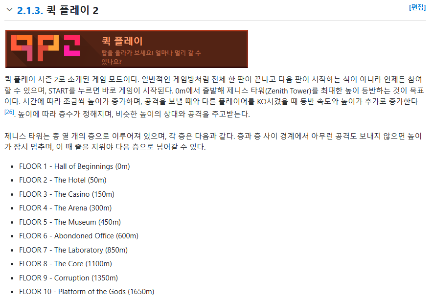

 

# Yoshie's Sprint PB 🏆

**YOOOO** check out this new personal best in sprint that my bestie **Yoshie** just got!  
He truly is the _elitest elite stacker of all time!_

> (p.s. not really. He needs waaaay more **T-Spins**.)

---

## But Seriously... 😴

Ok honestly though, that mode is **boooooring**.  
Where's all the **garbage** at? No challenge at all.

---

## The Zenith Tower Challenge 🏯

Tell me, what is the highest **floor and altitude** in the **Zenith Tower** that Yoshie has climbed up to?

### 🔹 Flag Format:

- **Floor Name**: The **name** (NOT number) of the floor. _Include space(s)._
- **Altitude**: A **number** to one decimal place, **commas optional**, with **m** at the end for meters.
- There is a **space** between the entries.

---

🔎 **Can you find the correct flag?**  
Good luck! 🚀

  

일단, Zenith Tower가 뭔지 검색해보니, tetr.io라는 테트리스 사이트에서 운영하는 게임 스테이지 중 하나였다.  

이 사실을 알고서 문제를 다시 보니, yoshie가 새로운 기록을 갱신했는데, 그 기록을 기준으로 도달했을 당시에 층의 이름과 고도를 입력하면 되는거였다.  

문제에서 주어진 파일에서 단서를 얻을 만한 것은 yoshie의 아이디가 yoshie878이라는 것뿐이었다.  

 
해당 부분은 나무위키에서 알려준 정보이다.  

https://ch.tetr.io/h/zenith/2024w33 
이 링크는 tetr.io라는 사이트의 리더보드이다. 여기 보면, 플레이어의 ID를 검색할 수 있는 칸이 있기에 ysohie878을 검색하였다.  

https://ch.tetr.io/u/yoshie878 
이 곳이 문제 출제자의 tetr.io 프로필이다. 
해당 유저의 기록에서 가장 높은 고도의 기록이 1,015.8m 였다. 
1,015.8m면 FLLOR 7의 The Laboratory에 해당되기에 플래그 값은 
bronco{The Laboratory 1,015.8m} 가 되겠다.
