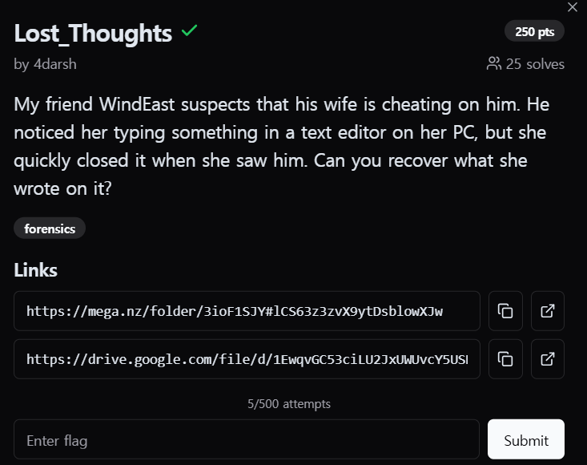

<br>
내 친구 WindEast는 그의 아내가 바람을 피우고 있다고 의심하고 있다. 그는 그녀가 PC의 텍스트 편집기에 무언가를 입력하는 것을 보았지만, 그가 보자마자 그녀는 재빨리 창을 닫아버렸다. 그녀가 작성한 내용을 복구할 수 있는가?<br><br>

https://u0041.co/posts/articals/exploring-windows-artifacts-notepad-files/<br>
해당 링크를 참고해서 파일 목록을 구한 뒤,<br>

```
python ../vol.py -f ../../dump.mem windows.dumpfiles --virtaddr 0x8e0dee681360
```

<br>
다음과 같은 명령어를 사용하여 파일을 추출하였다.<br><br>

NP:::cGVhcmx7YzBuZ3I0dHVsNHRpMG41X3kwdV9nMHRfdGgzX20zc3M0ZzN9==�!z�%<br><br>

pearl{c0ngr4tul4ti0n5_y0u_g0t_th3_m3ss4g3}
