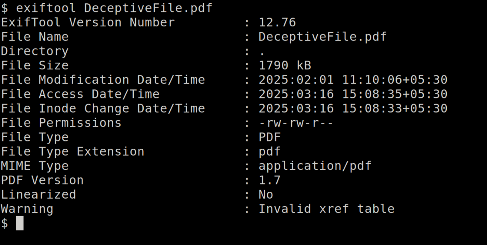
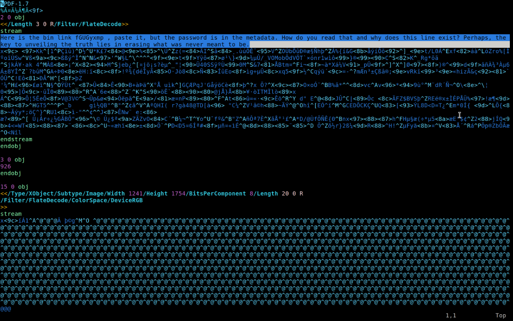
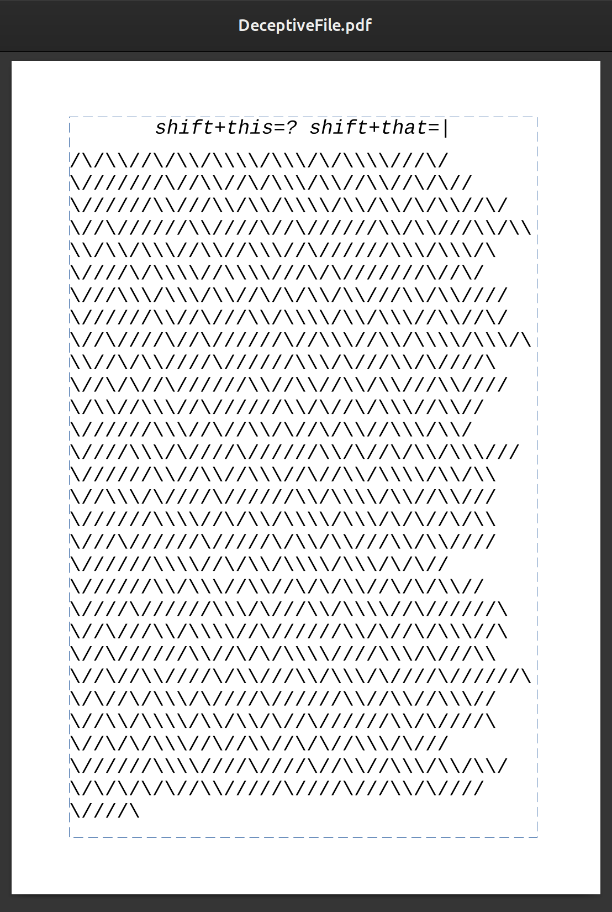
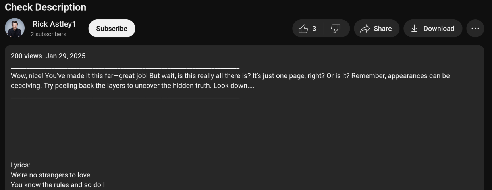
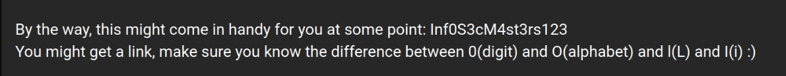
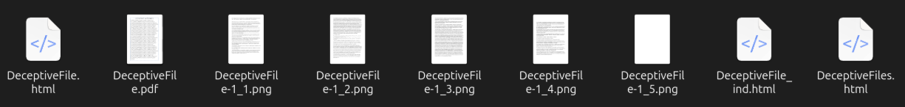
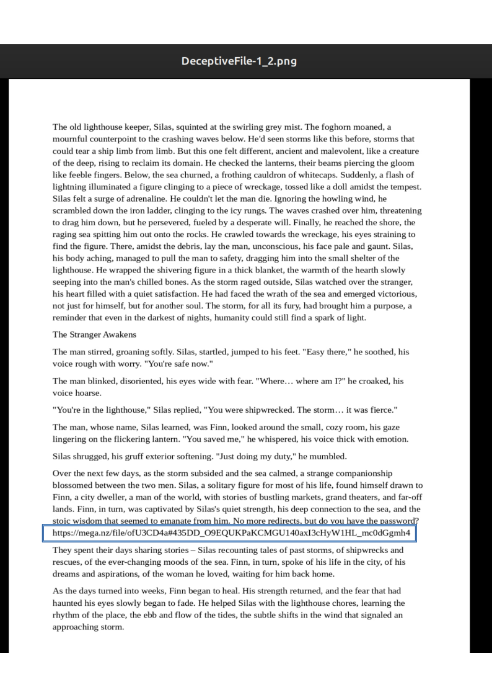
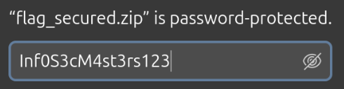

# CTF Write-Up: PlayerDelF

**Challenge Name**: PlayerDelF  
**Author**: iamgreedy

---

## 📝 **Challenge Info**

> Sometimes, the meaning is hidden in the spaces between the words—don’t just focus on what’s on the surface.
>
> But before that, it’s a PDF, but why isn’t the content showing?  
> Maybe the answer lies in what you don’t immediately see. Try looking a bit deeper, especially where things begin.

---

## 🔎 **Analysis and Solution**

### 1. **Opening the File**

- PDF 파일을 열었을 때 아무 내용도 보이지 않거나 손상된 것처럼 보였음
- 메타데이터를 확인했지만 유용한 정보는 없었고, 오류가 표시됨
- 힌트에서 "처음에 무엇이 있는지 보라"는 언급이 있었음



---

### 2. **Inspecting with a Text/Hex Editor**

- PDF 파일을 헥스 에디터로 열어보니 의심스러운 첫 번째 라인이 있었음
- 이 라인에 Pastebin 링크와 다음과 같은 메시지가 포함되어 있었음:
  ```
  "Erasing what was never meant to be."
  ```
- 메타데이터가 비어있다고 했지만 실제로는 숨겨져 있었음
- 오브젝트 2의 스트림 데이터 길이가 일치하지 않았음 → 첫 번째 라인을 삭제해야 함
- 첫 번째 라인을 삭제하자 메타데이터에 비밀번호가 나타남



---

### 3. **Checking the Pastebin Link**

- Pastebin 링크는 함정이었고, 링크를 열어보니 **Rickroll**이었음

---

### 4. **Extracting Hidden Content from the PDF**

- 첫 번째 라인을 삭제하자 PDF 내용이 보이기 시작했음
- 보이는 내용에 `/` 와 `\`가 포함된 문자열이 있었음
  - `/` → 0
  - `\` → 1
- 이를 바이너리로 변환 후 디코딩 → YouTube 링크 획득



---

### 5. **YouTube Video and Description**

- YouTube 링크는 또 다른 **Rickroll**이었음
- 그러나 비디오 설명에서 "layers"에 대한 힌트가 있었음
- 아래로 스크롤하자 비밀번호로 보이는 문자열 발견





---

### 6. **Extracting Layers from the PDF**

- "layers" 힌트를 따라 PDF의 숨겨진 레이어를 추출
- **pdftohtml** 또는 **GIMP/Photoshop**으로 PDF 추출

```bash
pdftohtml DeceptiveFile.pdf
```

<br><br>

<br><br>



이 과정을 거쳐서 숨겨진 페이지에서 mega 다운로드 링크를 발견함<br><br>

다운로드 링크에서 flag_secured.zip 파일을 다운로드 한 뒤, youtube 설명에서 얻은 비밀번호로 압축을 해제하고 압축을 풀면 최종 플래그를 발견할 수 있었다.<br><br>

<br><br>

최종 플래그 : pearl{PDF_1ay3r_3xtract10n_Adv3ntur3}
