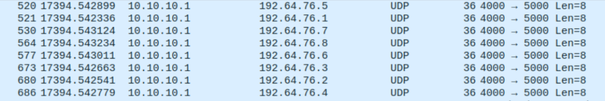
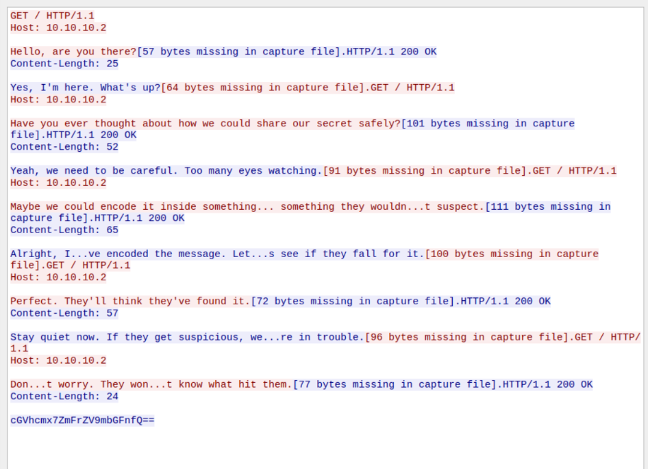
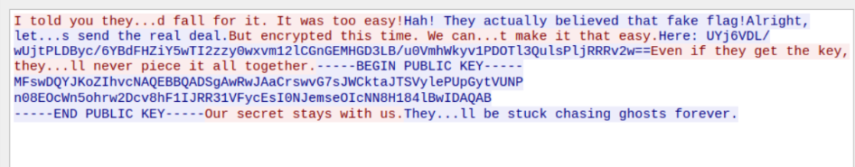

# The Covert Exchange

이 챌린지는 Wireshark에서 **패킷 캡처(PCAP)** 파일을 분석하는 과제이다. 목표는 **UDP 패킷**에 숨겨진 **AES 암호화된 메시지**를 추출하고, **TCP 패킷**에 숨겨진 키를 사용해 메시지를 복호화하는 것이다.

---

## 📌 Step 1: 패킷 분석하기

PCAP 파일을 Wireshark에서 열고 캡처된 패킷을 분석해 볼 것이다.
패킷을 정렬해 보면 **TCP, UDP, HTTPS** 등의 다양한 프로토콜이 포함된 것을 확인할 수 있다.



---

## 📌 Step 2: UDP 패킷 식별하기

1. **UDP 패킷 필터링**

   - 필터에 `udp`를 입력하여 UDP 패킷만 표시한다.

2. **패킷 정렬 및 데이터 추출**
   - 동일한 소스 IP에서 여러 개의 목적지 IP로 전송된 **8개의 UDP 패킷**을 확인한다.
   - 이 패킷들의 데이터를 추출한 뒤, **목적지 IP 기준으로 정렬**하면 **AES 암호화된 텍스트**가 나타난다.

### ✅ Alternative Method:

- Wireshark의 **프로토콜 계층 보기** 사용하기  
  → **Statistics > Protocol Hierarchy** 메뉴에서 필터를 적용해 UDP 패킷을 찾을 수 있다.

---

## 📌 Step 3: 복호화 키 찾기

AES로 암호화된 메시지를 복호화하려면 암호화 키를 찾아야 한다.

1. **HTTPS 패킷 확인**
   - HTTPS 패킷에서 Base64로 인코딩된 정보를 확인할 수 있다.
   - 그러나 Base64를 디코딩해 보면 **가짜 플래그**(Decoy)로 판명된다.



2. **TCP 패킷 확인**
   - TCP 패킷에서 다른 대화 내용을 찾는다.
   - 이 대화 중에서 **RSA로 암호화된 메시지**가 포함된 것을 확인한다.



---

## 📌 Step 4: AES 키 추출하기

1. 제공된 공개 키(public key)를 사용해 RSA 암호화된 메시지를 복호화한다.
2. 복호화된 메시지에서 **AES 키**를 추출한다.

```plaintext
thisisasecretkey
```

<br><br>

추출한 AES 키를 사용해 UDP 패킷에서 추출한 메시지를 복호화하면?<br>
복호화된 메시지에서 최종 플래그를 얻을 수 있다.<br><br>

pearl{tcp_hides_keys_udp_hides_flag}
