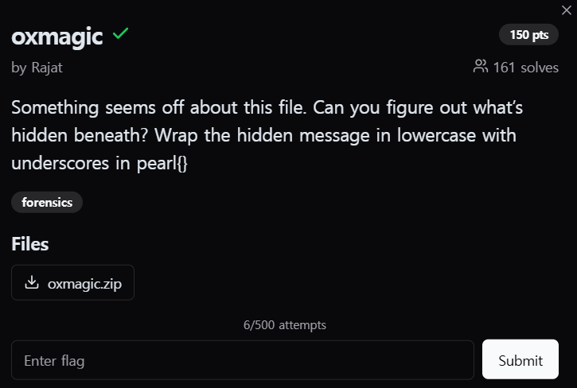

<br>
이 파일에 뭔가 이상한 점이 있는 것 같다. 숨겨진 메시지가 무엇인지 알아낼 수 있는가?<br><br>

👉 숨겨진 메시지를 소문자와 밑줄로 묶어서 pearl{} 형식으로 입력하라.<br><br>

<br>
문제에서 주어진 이미지는 다음과 같다.<br>

# Metadata Inspection

## 1. 메타데이터 검사

**exiftool**을 사용해 `chall.jpg`의 메타데이터를 검사한 결과, **Artist** 필드에 다음과 같은 비정상적인 항목이 발견되었습니다.

```
Artist : aV9sb3ZlX3Jvc2U=

Base64 문자열로 인코딩된 것으로 보인. 이를 디코딩하면 다음과 같은 결과가 나온다.

$ echo "aV9sb3ZlX3Jvc2U=" | base64 -d
i_love_rose

```

## 2. 스테가노그래피 도구로 숨겨진 데이터 추출

디코딩된 문자열(i_love_rose)을 암호로 사용해 steghide로 이미지에서 숨겨진 데이터를 추출한다.<br>

```
$ steghide extract -sf chall.jpg
Enter passphrase: i_love_rose
wrote extracted data to "flag.txt".
```

flat.txt 파일이 생성되었지만 파일 형식을 인식하지 못하고 있었다.<br><br>

추출된 파일의 형식을 HxD로 열어 보면 WAV 파일 헤더가 손상되어있었다.<br><br>

올바른 WAV 헤더로 수정한 후 다시 검사하였다.<br><br>

```
$ file flag.txt
flag.txt: RIFF (little-endian) data, WAVE audio, Microsoft PCM, 8 bit, mono 8000 Hz
```

<br><br>
flag.wav를 재생해보면 모스 부호(Morse Code) 소리가 들린다.<br><br>

steghide extract -sf chall.jpg -p "i_love_rose"<br><br>

이를 디코딩하면 다음과 같은 메시지가 나온다.<br>
M4G1C BYT3S 1S THE W4Y<br>
그리하여, 플래그는 다음과 같다.<br>

pearl{m4g1c_byt3s_1s_the_w4y}
