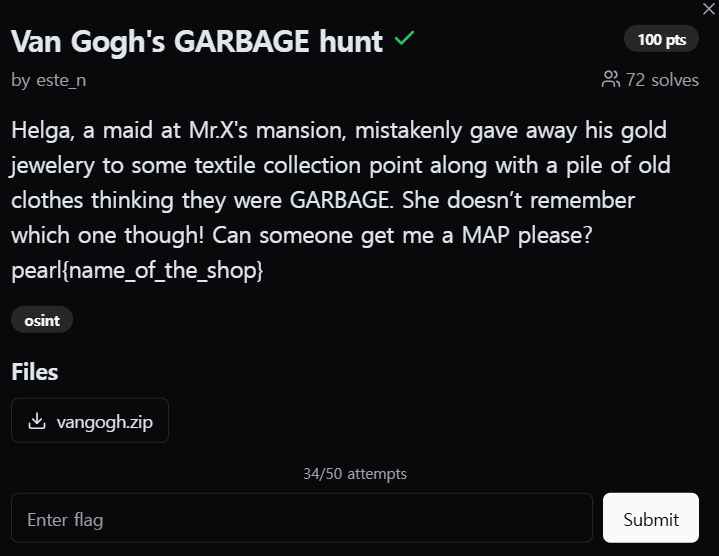
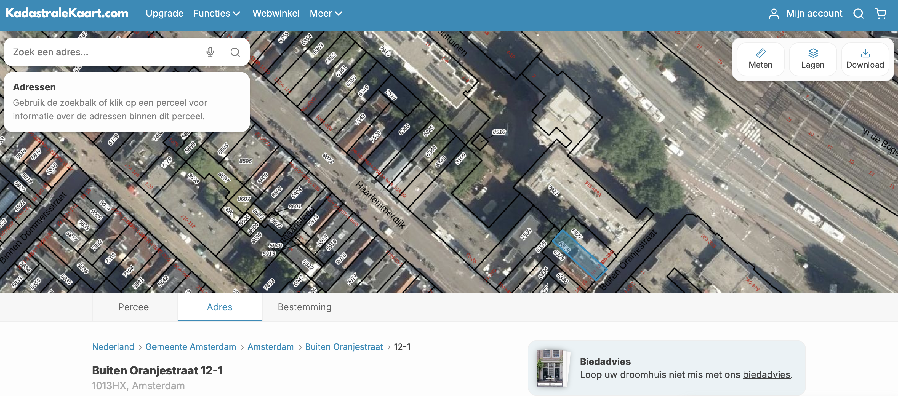

  

헬가(Helga)는 Mr.X의 저택에서 일하는 하녀인데, 실수로 금 보석을 헌 옷 더미와 함께 쓰레기로 착각하고 섬유 수거 지점에 넘겨버렸다. 그런데 그녀는 어떤 수거 지점이었는지 기억하지 못하고 있다. 지도를 구해줄 수 있는 지를 묻고 있는 문제이다. 
플래그 형식: pearl{상점\_이름}  

 
문제에서 이미지 파일을 주었는데, 구글 렌즈를 통해서 해당 위치를 찾아내었다.  

https://www.google.com/maps/place/Haarlemmerplein+17E/@52.3829086,4.88669,43m/data=!3m1!1e3!4m7!3m6!1s0x47c609d20df898a3:0x817446f4380ee3ac!4b1!8m2!3d52.3841924!4d4.8835204!16s%2Fg%2F11c21gdw99?entry=ttu&g_ep=EgoyMDI1MDMwNC4wIKXMDSoASAFQAw%3D%3D  

pearl{the_swapshop}
