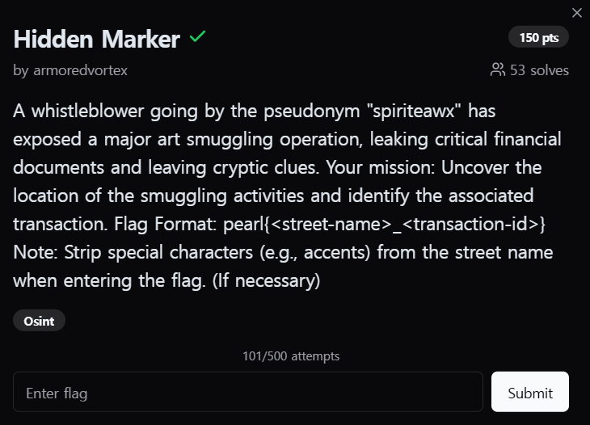
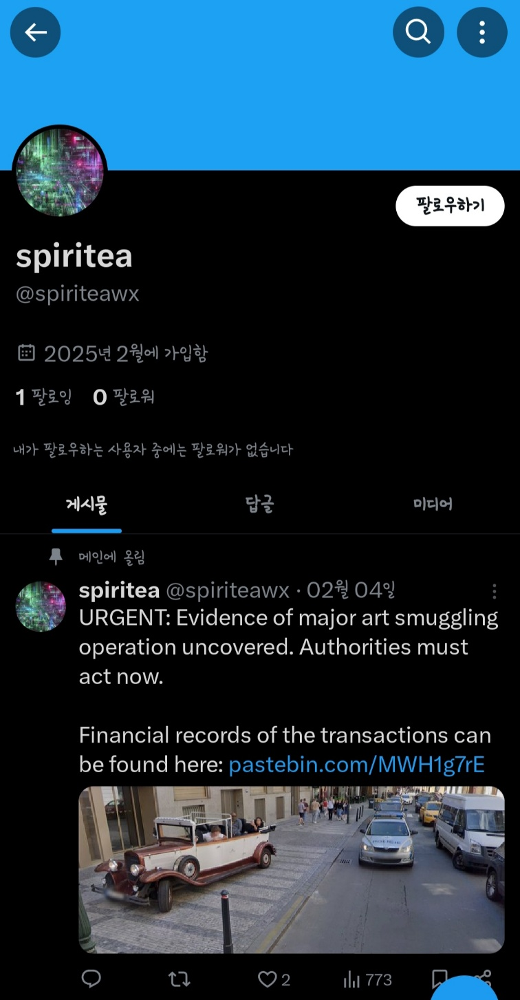
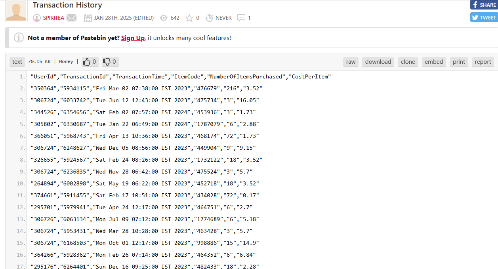
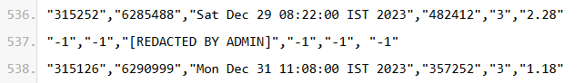
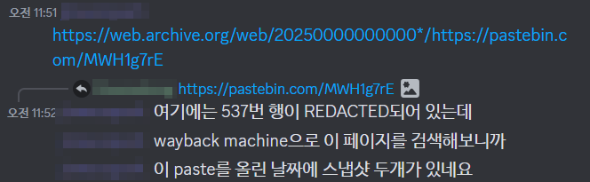
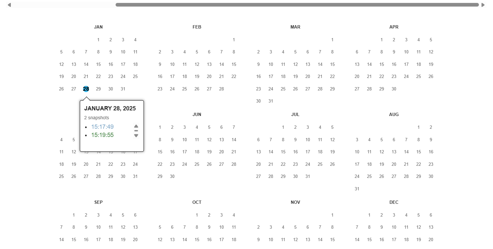
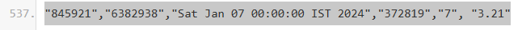

  

익명의 제보자 "spiriteawx"가 대규모 미술 밀수 작전을 폭로하며 중요한 금융 문서를 유출하고 암호화된 단서를 남겼다. 
당신의 임무: 밀수 활동의 위치를 밝혀내고 관련 거래를 식별하면 된다.  

플래그 형식: pearl{<거리-이름>\_<거래-ID>} 
👉 거리 이름 입력 시 특수 문자(예: 악센트)를 제거하십시오. (필요한 경우)  

플래그 형식에서 힌트가 있듯이, 거리를 찾으면 되는 문제인 것 같다.  

 
문제에서 주어진, spiriteawx 관련해서 여기저기 탐색을 해보다가 다음과 같이 'spiritea'라는 유저의 트위터 계정을 발견하게 되었다.  

더군다나, 문제와 관련되어있는 미술품 밀수 작전과 관련된 게시물이 메인에 올려져 있었으며, 거래 내역을 정리한 자료들을 링크로 올려두었다. 사진의 장소는 어디일까?  

https://www.google.com/maps/@50.087255,14.4270832,3a,90y,230.65h,76.46t/data=!3m7!1e1!3m5!1s-oGOCrA6RJRuYESrJDTd3Q!2e0!6shttps:%2F%2Fstreetviewpixels-pa.googleapis.com%2Fv1%2Fthumbnail%3Fcb_client%3Dmaps_sv.tactile%26w%3D900%26h%3D600%26pitch%3D13.540000000000006%26panoid%3D-oGOCrA6RJRuYESrJDTd3Q%26yaw%3D230.65!7i16384!8i8192?entry=ttu&g_ep=EgoyMDI1MDMwNC4wIKXMDSoASAFQAw%3D%3D  

링크가 좀 길지만, 이 곳이 사진의 위치와 동일한 곳이다. 33 첼레트나, 프라하이다. 
첼레트나라는 지명에 악센트가 들어가 있는 것으로 보아 얼추 맞게 찾아온 것 같다.  

다음으로는, 'spiritea'이 남겨놓은 거래 목록을 보자. 
https://pastebin.com/MWH1g7rE  

 
대충 데이터 형식은 다음과 같이 정리되어있다. 유저id, 거래id, 거래시간, 물건코드, 구매한 물건의 개수, 물건 당 가격  

 
쭉 내리다보니 중간에 이상한 데이터가 끼워져 있다. 
"Redacted"는 특정 정보가 편집되었거나 삭제되었다는 의미인데 일반적으로 기밀이나 민감한 정보를 보호하기 위해 문서나 데이터에서 특정 부분이 가려졌을 때 사용된다.  

즉, 이 곳이 바로 키 포인트라는 소리가 된다.  

 
그러다가 팀원 분이 wayback machine으로 해당 페이지를 검색해보셨는데, 해당 paste를 올린 날짜에 스냅샷 2개가 발견되었다고 한다.  

 
보시다시피, 해당 Pastebin이 두 번 저장되었으며, 이는 해당 Pastebin에 두 개의 버전이 있다는 것을 의미한다.  

 
admin에 의해 지워졌던 곳이 채워져 있는 것을 확인할 수 있다.  

플래그 형식: pearl{<거리-이름>\_<거래-ID>}이니 
pearl{celetna_6382938}이 되겠다!
