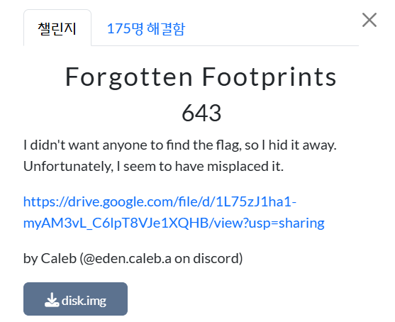
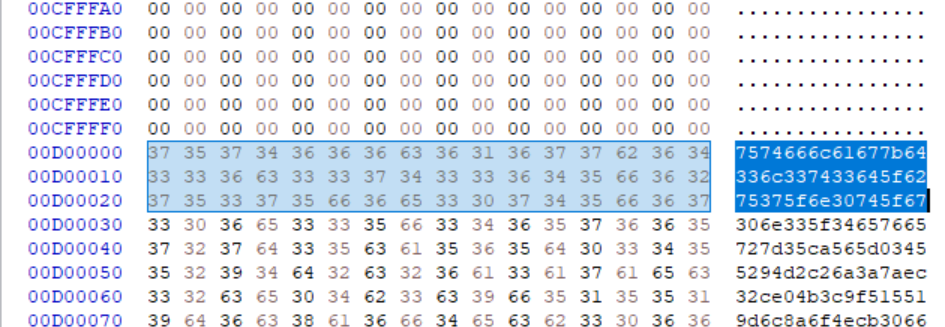
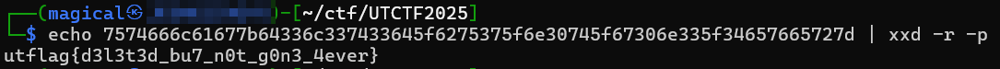

  

I didn't want anyone to find the flag, so I hid it away. 
Unfortunately, I seem to have misplaced it.  

나는 아무도 플래그를 찾지 못하게 하려고 숨겨 놓았어. 그런데 불행히도 어디에 뒀는지 잊어버린 것 같아....라는 문제이다.  

 
string으로 헥사값을 뽑아냈더니 다음과 같은 값들이 있었다.  

  

따라서, flag는 
utflag{d3l3t3d_bu7_n0t_g0n3_4ever}
