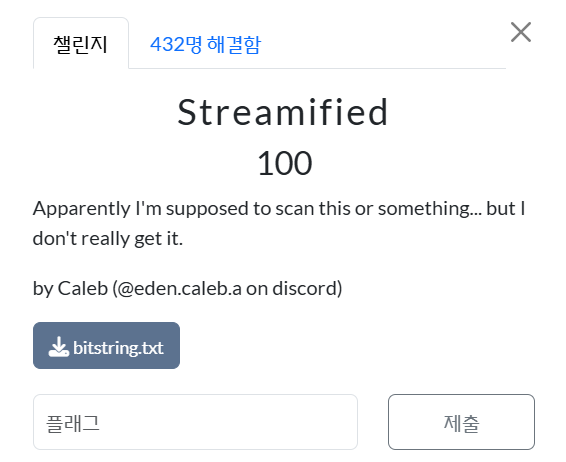
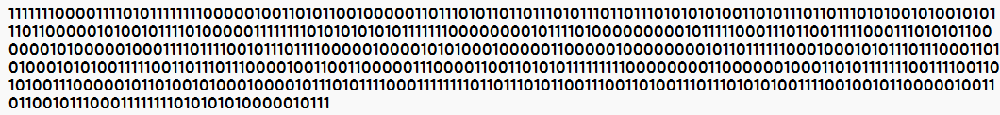
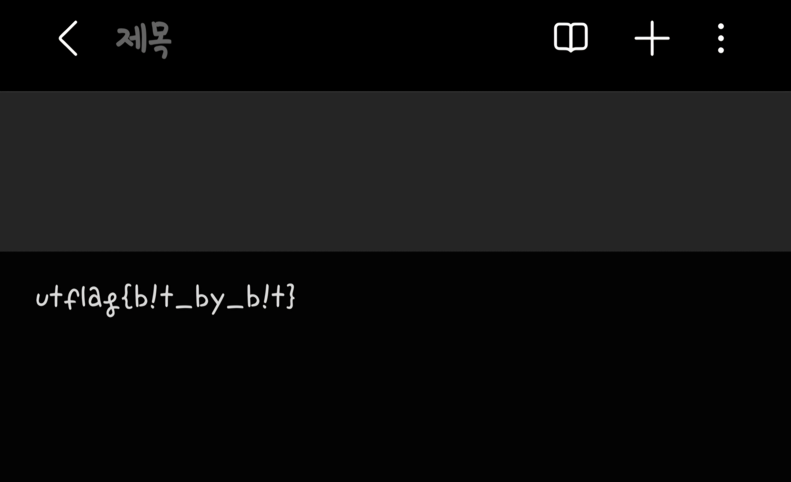

 

Streamified(100) 
Apparently I'm supposed to scan this or something... but I don't really get it.  

하고 txt 파일을 하나 주었다.  

 
txt파일의 내용이다. 
0과 1을 어떻게 사용할 지 고민하다가, 1은 검은색 0은 흰색으로 25x25 그리드로 매핑하였다.  

그랬더니, QR코드가 등장하였다.  

 
QR코드를 인식하니, 플래그가 등장하였다.  

utflag{b!t_by_b!t}
