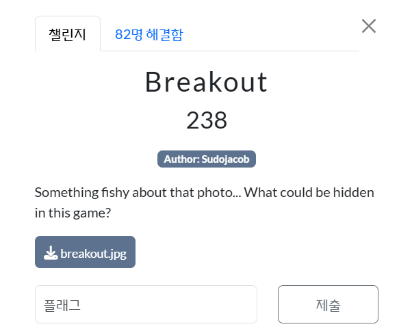
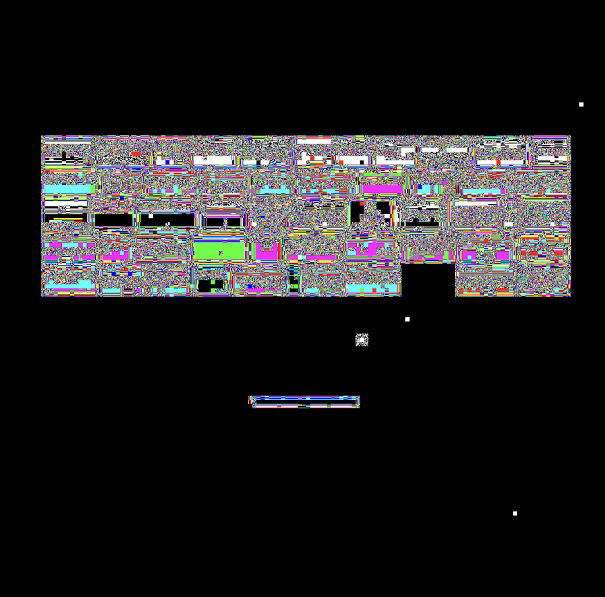

<br><br>

사진에 무언가 숨겨져 있으며, 게임과 관련이 있는 듯 하다.<br><br>

<br><br>

<br><br>
StegHide를 이용해 여기저기 만져보다가 특이한 확장자의 파일이 나왔다.<br><br>

[text](breakout.ch8)<br>
ch8이라는 확장자가 어떤 것인지 찾아보았다.<br><br>

# `.ch8` 파일 확장자 설명 및 열기 방법

## 📌 `.ch8`란?

- `.ch8` 파일은 **Chip-8** 가상 머신용 **게임 ROM** 파일이다.
- 1970년대에 설계된 **Chip-8**은 간단한 게임을 실행할 수 있도록 만들어진 **에뮬레이터용 플랫폼**입니다.
- `.ch8` 파일은 바이너리 형식이며, 일반적으로 다음과 같은 게임을 포함한다.
  - Pong
  - Tetris
  - Space Invaders 등

---

## 🔓 어떻게 실행하는가?

### 1. 에뮬레이터 사용

#### ✅ 웹 기반 에뮬레이터

- **Octo**: [https://johnearnest.github.io/Octo/](https://johnearnest.github.io/Octo/)
  - `.ch8` ROM 파일을 업로드하여 실행 가능

#### ✅ 데스크탑 에뮬레이터 (오픈소스)

- GitHub에서 `chip8 emulator` 검색
- Python 예시: [https://github.com/JohnEarnest/chip8](https://github.com/JohnEarnest/chip8)

### 2. 실행 예시 (Python 사용 시)

```bash
python chip8_emulator.py path/to/rom.ch8
```

<br><br>

아.. 테트리스 하니 이전 요시 OSINT 문제가 떠오른다.<br><br>

<br>
플래그는 다음과 같게 된다.<br>
WCTF{GAME_OVER_VMASBKLTNUFMGS}
