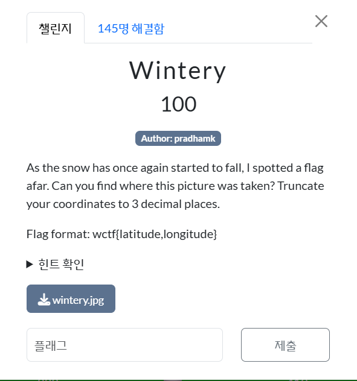
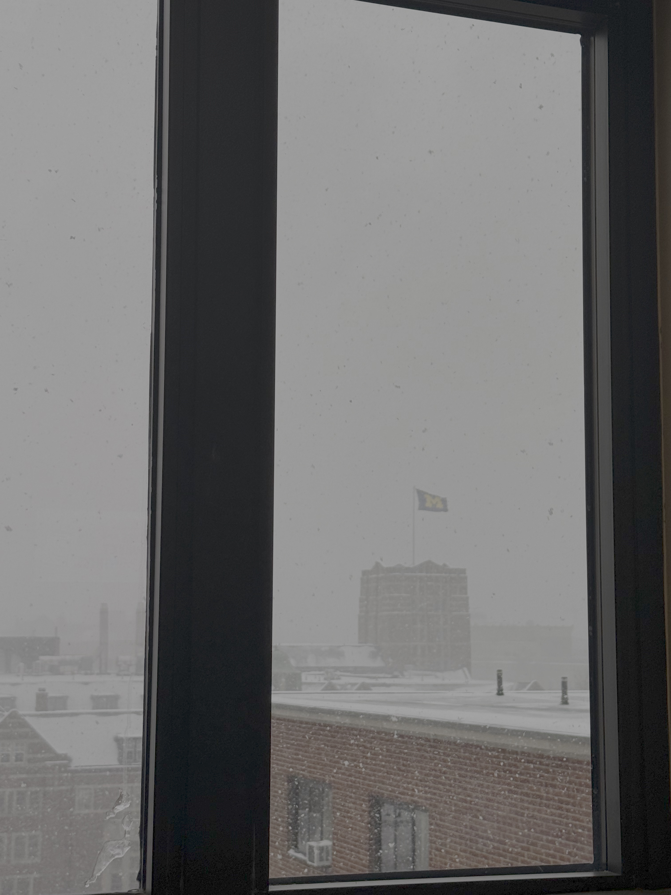
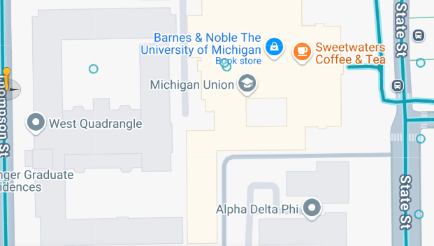
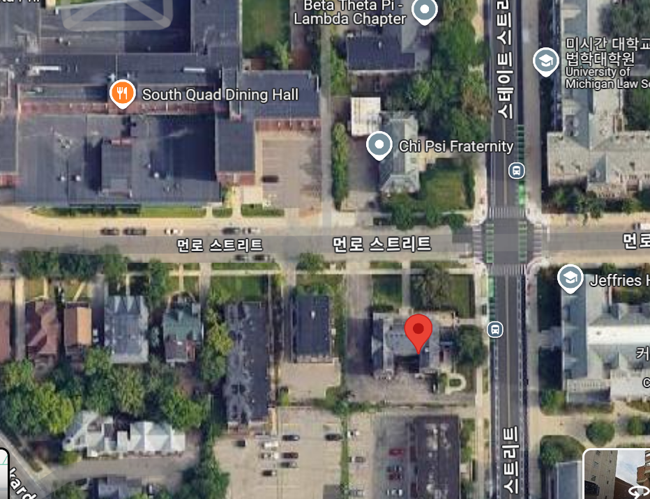

  

눈이 다시 한 번 내리기 시작할 때, 나는 멀리서 깃발 하나를 발견했다. 이 사진이 어디에서 찍혔는지 알아낼 수 있는가? 좌표는 소수점 셋째 자리까지 자르면 된다.  

플래그 형식: wctf{위도,경도}  

문제에서 주어진 이미지의 위치를 기반으로 경위도를 찾으면 되는 문제인 것 같다.  

 
문제 이미지이다. 깃발이 하나 펄럭이고 있는데, 노란색 M이라는 글씨가 써져있다. 
바로 미시간 대학교(University of Michigan)의 깃발이다.  

https://www.google.com/maps/@42.2746634,-83.7407194,3a,53.5y,324.96h,100.02t/data=!3m10!1e1!3m8!1s8hc8dCFnd-ZYbY214yEQdA!2e0!6shttps:%2F%2Fstreetviewpixels-pa.googleapis.com%2Fv1%2Fthumbnail%3Fcb_client%3Dmaps_sv.tactile%26w%3D900%26h%3D600%26pitch%3D-10.019707293052349%26panoid%3D8hc8dCFnd-ZYbY214yEQdA%26yaw%3D324.9605614330587!7i16384!8i8192!9m2!1b1!2i35?entry=ttu&g_ep=EgoyMDI1MDMxOS4xIKXMDSoASAFQAw%3D%3D  

바로 이 건물이 이미지에서 보이는 건물인 것 같다.  

 
이 쯤인거 같은데...  

https://www.google.com/maps/@42.2742072,-83.7421384,3a,90y,131.55h,102.48t/data=!3m7!1e1!3m5!1sbO9Tg8J51pQyEl_DgcNZ6w!2e0!6shttps:%2F%2Fstreetviewpixels-pa.googleapis.com%2Fv1%2Fthumbnail%3Fcb_client%3Dmaps_sv.tactile%26w%3D900%26h%3D600%26pitch%3D-12.480365980785578%26panoid%3DbO9Tg8J51pQyEl_DgcNZ6w%26yaw%3D131.5516589696329!7i16384!8i8192?entry=ttu&g_ep=EgoyMDI1MDMxOS4xIKXMDSoASAFQAw%3D%3D  

  

wolvctf{42.273,-83.741}
