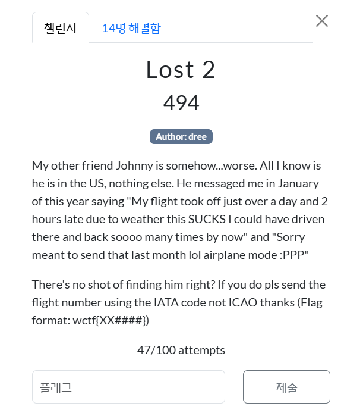
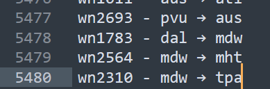

<br>
고생 꽤나 한 문제이다.<br><br>

내 또 다른 친구 조니는 어떻게 된 게... 지미보다 더 심각해. 내가 아는 건 그가 미국에 있다는 것뿐, 다른 건 아무것도 몰라.<br.>
그가 올해 1월에 나에게 메시지를 보냈는데 이렇게 말했어:<br>
"비행기가 날씨 때문에 예정 시간보다 하루하고 2시간 넘게 늦게 출발했어. 진짜 최악이야. 그 시간에 차 몰고 갔다가 몇 번은 돌아올 수 있었겠다 진짜."<br>
그리고 나중에 또 말하길:<br>
"미안ㅋㅋ 저거 지난달에 보내려던 거였는데 비행기 모드라서 이제야 보냄 :PPP"<br><br>

처음 팀원들과 접근한 방법은 미국의 국내선 중에서 26시간동안 지연이 된 비행기를 찾는 것이었다.<br>
1월을 기준으로 보다가 지난달에 보내려던 문자라는 힌트를 보고 12월을 기준으로 돌렸다.<br><br>

https://www.fox10phoenix.com/news/when-pigs-fly-odor-prompts-airliner-make-unscheduled-stop-bermuda<br>
처음 비스무리 하게 찾은 것이지만 국내선이 아니었다.<br><br>

wctf{AA78} X https://www.flightaware.com/live/flight/AAL78/history/20241217/0255Z/KDFW/EGLL<br>
팀원분과 flightaware 페이지를 통해서 OSINT를 해봤지만 계속된 시도에도 답이 나오지 않았다.<br><br>

```
import requests
import json
import time

# API 키
API_KEY = "db3b2e-6dbb35"

# Aviation Edge API 기본 URL
BASE_URL = "https://aviation-edge.com/v2/public/flightsHistory"

# 테스트할 공항 (주요 미국 공항 몇 개)
TEST_AIRPORTS = ["ATL", "DFW", "ORD", "LAX", "JFK"]

# 테스트할 날짜 (작년 12월 31일)
TEST_DATE = "2024-12-31"

# 지연 시간 범위 (약 26시간 = 1560분)
TARGET_DELAY = 1560
DELAY_RANGE = 30  # ±30분

def test_airport_data(airport, search_type):
    """
    Args:
        airport: 공항 IATA 코드
        search_type: 'departure' 또는 'arrival'
    """
    print(f"\n{airport} 공항 {search_type} ({TEST_DATE}) 테스트 중...")

    try:
        # API 호출을 위한 파라미터
        params = {
            "key": API_KEY,
            "code": airport,
            "type": search_type,
            "date_from": TEST_DATE
            # 필요한 경우 extra_key 파라미터 추가
            # "extra_key": "YOUR_EXTRA_KEY_HERE"
        }

        # API 요청
        response = requests.get(BASE_URL, params=params)

        # 응답 코드 확인
        if response.status_code != 200:
            print(f"API 오류: 상태 코드 {response.status_code}")
            print(f"응답 내용: {response.text[:200]}...")
            return

        # 응답 데이터 파싱
        data = response.json()

        # 데이터 형식 확인
        if not isinstance(data, list):
            if isinstance(data, dict):
                # 단일 결과인 경우
                print("단일 결과, 검사시작작:")
                print(json.dumps(data, indent=2))
                data = [data]
            else:
                print(f"예상치 못한 API 응답 형식: {type(data)}")
                print(f"응답 내용: {str(data)[:200]}...")
                return

        # 데이터 개수 확인
        print(f"총 {len(data)}개의 항공편 데이터")

        if not data:
            print("결과X")
            return

        # 첫 번째 항목 구조 확인
        print("\n첫 번째 항공편 데이터 구조 참고고:")
        print(json.dumps(data[0], indent=2))

        # 모든 항공편의 지연 정보 확인
        delayed_flights = []

        for flight in data:
            # 출발/도착 정보 확인
            departure = flight.get("departure", {})
            arrival = flight.get("arrival", {})

            # 지연 정보 확인
            dep_delay = departure.get("delay")
            arr_delay = arrival.get("delay")

            # 출발 지연이 약 26시간인 경우
            if dep_delay:
                try:
                    dep_delay_mins = int(dep_delay)
                    if abs(dep_delay_mins - TARGET_DELAY) <= DELAY_RANGE:
                        flight["primary_delay"] = dep_delay_mins
                        flight["delay_type"] = "departure"
                        delayed_flights.append(flight)
                except (ValueError, TypeError):
                    pass

            # 도착 지연이 약 26시간인 경우
            if arr_delay:
                try:
                    arr_delay_mins = int(arr_delay)
                    if abs(arr_delay_mins - TARGET_DELAY) <= DELAY_RANGE:
                        flight["primary_delay"] = arr_delay_mins
                        flight["delay_type"] = "arrival"
                        # 이미 출발 지연으로 추가되었는지 확인
                        if flight not in delayed_flights:
                            delayed_flights.append(flight)
                except (ValueError, TypeError):
                    pass

        # 지연된 항공편 결과 출력
        print(f"\n약 26시간 지연된 항공편: {len(delayed_flights)}개")

        for i, flight in enumerate(delayed_flights, 1):
            airline = flight.get("airline", {})
            flight_info = flight.get("flight", {})
            departure = flight.get("departure", {})
            arrival = flight.get("arrival", {})

            print(f"\n지연 항공편 {i}:")
            print(f"  항공편: {flight_info.get('iataNumber', '')}")
            print(f"  항공사: {airline.get('name', '')} ({airline.get('iataCode', '')})")
            print(f"  경로: {departure.get('iataCode', '')} → {arrival.get('iataCode', '')}")
            print(f"  지연 유형: {flight.get('delay_type', '')}")
            print(f"  지연 시간: {flight.get('primary_delay', '')}분")
            print(f"  출발 지연: {departure.get('delay', '0')}분")
            print(f"  도착 지연: {arrival.get('delay', '0')}분")
            print(f"  상태: {flight.get('status', '')}")

    except Exception as e:
        print(f"테스트 중 오류 발생: {str(e)}")

def main():
    print(f"테스트 시작 - {TEST_DATE}")
    print("약 26시간(1560분) 지연된 항공편 검색")

    for airport in TEST_AIRPORTS:
        # 출발 데이터 테스트
        test_airport_data(airport, "departure")
        time.sleep(1)

        # 도착 데이터 테스트
        test_airport_data(airport, "arrival")
        time.sleep(1)

    print("\n테스트 완료.")

if __name__ == "__main__":
    main()
```

<br><br>
api를 이용해서 스크립트를 짜 찾아봐도 쉽지 않았다.<br><br>

<br>
5000개가 넘어간다 심지어...ㅋㅋㅋㅋ<br><br>

https://www.transtats.bts.gov/DL_SelectFields.aspx?gnoyr_VQ=FGJ&QO_fu146_anzr=b0-gvzr<br>
그러다가 팀원 한 분이 정부 사이트에 가서 데이터 받고<br><br>

```
import pandas as pd
df = pd.read_csv("/Users/ma._.gical/Downloads/T_ONTIME_REPORTING.csv")
df = df[df["CANCELLED"] == 0.0]
df = df[df["WEATHER_DELAY"] > 25 * 60]
df
```

코드를 짜셨더니 2건밖에 나오지 않았다고 하셨다.<br><br>

wctf{AA3243}<br><br>

이 문제 푸는데 10명 넘게 달라붙어서 하루 넘게 걸렸다..
