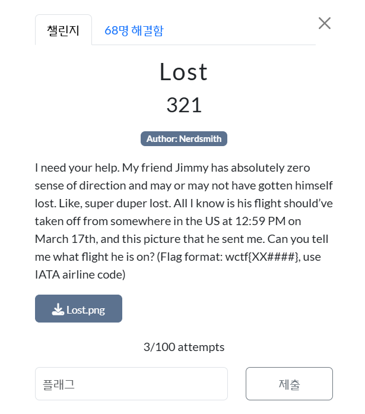
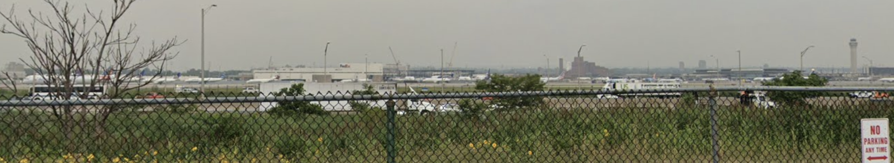

  

lost-2에 비하면 선녀다 선녀...  

도와줘야 해. 내 친구 지미는 방향 감각이 전혀 없어서, 어쩌면 진짜 엄청 길을 잃었을 수도 있어. 
아주, 아주 심하게. 내가 아는 건, 지미의 비행기가 **3월 17일 오후 12시 59분(현지 시간)**에 미국 어딘가에서 출발했다는 거랑, 그가 보낸 이 사진뿐이야. 
지금 내가 알고 싶은 건: 지미가 탄 비행기가 무엇인지 알려줄 수 있어?  

 
제공된 사진은 위와 같다... 철창이 쳐져 있다.  

https://www.google.com/maps/@40.6772221,-74.1717907,3a,85.5y,260.35h,94.07t/data=!3m7!1e1!3m5!1sXQBfRYwA6wz57_GsP3Cu5Q!2e0!6shttps:%2F%2Fstreetviewpixels-pa.googleapis.com%2Fv1%2Fthumbnail%3Fcb_client%3Dmaps_sv.tactile%26w%3D900%26h%3D600%26pitch%3D-4.069688420809669%26panoid%3DXQBfRYwA6wz57_GsP3Cu5Q%26yaw%3D260.3521409837009!7i16384!8i8192?entry=ttu&g_ep=EgoyMDI1MDMyMy4wIKXMDSoASAFQAw%3D%3D  

https://www.flightstats.com/v2/flight-tracker/departures/EWR/?year=2025&month=3&date=22&hour=12  

최종 플래그는 다음과 같다. 
wctf{UA2050}
